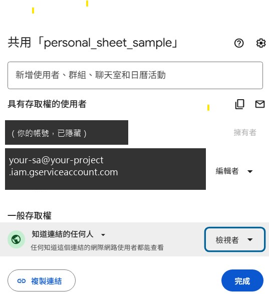

# 新使用者設定教學

面向：已經加 PlateScan LINE 好友，或開始跟 Telegram Bot 對話的使用者，想知道要怎麼開始記錄飲食。加好友（LINE）／首次對話送出 `/start`（Telegram）時，Bot 會自動傳送本篇教學的文字版；本文件補充截圖與細節，也可以隨時在對話中輸入「新手教學」重新叫出文字版。

## 1. 建立個人 Google 試算表

去 [Google Sheets](https://sheets.google.com) 建立一個新的空白試算表即可，**不需要自己建立任何分頁或欄位**——完成下面「設定 {Sheet ID}」綁定時，Bot 會自動幫你建立需要的 `daily_log`（飲食紀錄）與 `goals`（每日目標）工作表。

## 2. 分享權限（同一個「共用」視窗完成兩件事）

點試算表右上角「共用」，畫面會出現：



1. 上方輸入框貼上 Service Account 的 email（Bot 第一次跟你互動、或輸入「新手教學」時會直接告訴你實際的信箱），權限選「編輯者」，送出邀請——這一步讓 Bot 有權限寫入你的飲食紀錄。
2. 同一個視窗下半部「一般存取權」，從「限制」改成「知道連結的任何人」，角色選「檢視者」——這一步是**選填**的，只有想用「圖表」功能（PWA 視覺化儀表板）時才需要；不開的話 Bot 記錄功能完全不受影響。

> 上方截圖是示意畫面（擁有者頭像/姓名/個人信箱已打碼，Service Account Email 已改為通用範例），實際操作請以 Bot 告訴你的真實 email 為準。

## 3. 綁定 Sheet ID

回到跟 Bot 的對話，輸入：

```
設定 {Sheet ID}
```

`{Sheet ID}` 可以直接貼整段 Google Sheets 網址（Bot 會自動擷取其中的 ID），例如：

```
設定 https://docs.google.com/spreadsheets/d/1AbCdEfGhIjKlMnOp/edit
```

綁定成功後 Bot 會回覆確認訊息，並告知是否有自動建立缺少的工作表。若失敗（通常是還沒完成步驟 2 的編輯者授權，或 ID／網址複製錯誤），Bot 會提示需要確認的項目，修正後重新輸入一次即可。

## 4. 開始使用

- 傳照片或輸入餐點文字描述，會先暫存在緩衝區，可以累積多筆。
- 輸入 `ok` 觸發 AI 辨識，結果會寫入 `daily_log` 工作表，並收到辨識結果回覆。
- 輸入 `今日` 查詢當天累計營養素。
- 想設定每日營養目標：輸入 `原始表單` 取得 Sheet 連結，直接在 `goals` 工作表填寫；或直接用指令，例如 `設定目標 熱量 2000`。
- 想看視覺化圖表：輸入 `圖表`（需完成步驟 2 的「知道連結的人可檢視」設定）。
- 完整指令列表：輸入 `說明`。

## 5. 常見問題

- **「圖表」給的連結打開後沒有資料？** 確認步驟 2 的「一般存取權」是否已設為「知道連結的任何人」。
- **輸入「設定 {Sheet ID}」後 Bot 說「無法存取這個 Google Sheet」？** 通常是還沒把 Service Account 加為編輯者，或 Sheet ID／網址複製錯誤，請重新檢查步驟 2 與 3。
- **想換一份新的 Sheet？** 直接重新輸入「設定 {新的 Sheet ID}」即可覆蓋原本綁定，不需要先「取消」。

指令完整規格見 [commands.md](commands.md)，系統架構見 [architecture.md](architecture.md)。
